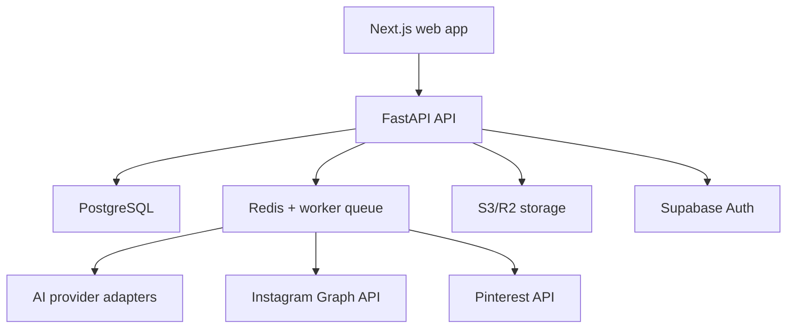

# Architecture

## Boundary rules
- The browser speaks only to the FastAPI API and Supabase Auth.
- Connector adapters own provider-specific request/response code.
- Workers perform long-running generation, scheduling and publishing.
- Media files live in object storage; the database only stores metadata and keys.
- Workspace membership is checked before every tenant-scoped read or write.
- Celery Beat claims due posts with row locks and dispatches them to platform workers.
